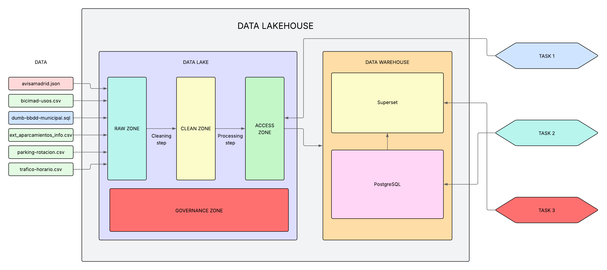

# Práctica Madrid Sostenible - Infraestructura de Almacenamiento para la Ciudad Inteligente

Este repositorio contiene la infraestructura y scripts necesarios para construir un **Data Lakehouse** que integra datos públicos de movilidad, urbanismo, medioambiente, energía y participación ciudadana para el análisis y la toma de decisiones sostenibles en Madrid. 

## Diagrama de infraestructura

La infraestructura diseñada combina un **Data Lakehouse** que integra un **Data Lake multicapa** y un **Data Warehouse dimensional** para garantizar una gestión flexible, escalable y orientada al análisis de datos urbanos. En la **RAW ZONE** del Data Lake se almacenan los datos en su formato original, mientras que en la **CLEAN ZONE** se aplican transformaciones y validaciones para asegurar calidad y coherencia. Finalmente, la **ACCESS ZONE** ofrece datos listos para el análisis, que alimentan tanto notebooks como bases de datos analíticas.

- **Pregunta 1:** Se abordará mediante un cuaderno `.ipynb`, trabajando directamente sobre los datasets ya transformados en la *ACCESS ZONE*.
- **Pregunta 2:** Se resolverá con consultas **SQL** sobre una base de datos **PostgreSQL** que contiene las tablas generadas a partir de los datos limpios.
- **Pregunta 3:** Se responderá mediante la construcción de **dashboards en Apache Superset**, conectados al **Data Warehouse**, con el objetivo de facilitar el análisis visual a perfiles no técnicos como ciudadanos o asociaciones vecinales.

## Modelo de datos diseñado

## 🧩 Procesos de Transformación ETL (Extract, Transform, Load)

### Fase 1: Extracción (Extract)

Contamos con 6 datasets: **trafico-horario.csv** (volumen y tipo de vehículos por hora), **bicimad-usos.csv** (trayectos y tipo de usuario), **parkings-rotacion.csv** (ocupación y ubicación de aparcamientos), **ext_aparcamientos_info.csv** (una extensión del dataset anterior), **dump-bbdd-municipal.sql** (una base de datos SQL con múltiples tablas) y **avisamadrid.json** (avisos ciudadanos geolocalizados).

Los datos se cargan inicialmente en un bucket de MinIO, dentro de la zona **raw**, utilizando la función `upload_file_to_minio` definida en `utils.py`. Esta zona conserva los archivos originales tal como fueron extraídos, creando una carpeta por dataset.

Antes de limpiar los datos, se realiza una conversión del archivo JSON a CSV mediante `extract_json_to_dataframe`, que convierte el archivo `avisamadrid.json` a un DataFrame. Asimismo, se utiliza `extract_sql_to_dataframes` para cargar las tablas definidas en el script SQL original, generando los datasets `distritos.csv`, `edificios_publicos.csv`, `estaciones_transporte.csv`, `lineas_transporte.csv` y `zonas_verdes.csv`. También se realiza la fusión de `ext_aparcamientos_info.csv` y `parkings-rotacion.csv` mediante una operación `merge`.

Posteriormente, se aplican transformaciones específicas a cada DataFrame y se almacenan como archivos `.parquet` en la **clean zone**, estructurados por temáticas. Estas transformaciones están implementadas en funciones específicas para cada dataset, que realizan los siguientes cambios:

---

### Fase 2: Transformación (Transform)

Siguiendo los principios de transición de la zona RAW a CLEAN, se aplicaron transformaciones centradas en:

- Estandarización de formatos
- Eliminación de duplicados
- Conversión de fechas y tipos numéricos
- Aplicación de reglas de validación (no nulos, unicidad, coherencia)

#### Ejemplos específicos por dataset:

- **Tráfico**: conversión de `fecha_hora` a datetime y eliminación de duplicados.
- **Bicimad**: tipado de fechas y validación de columnas clave como `usuario_id`.
- **Parkings**: unión de CSVs, conversión de coordenadas y tarifas, y deduplicación por clave compuesta.
- **Consumo energético**: conversión de fechas y validación de métricas como `consumo_electrico_kwh`.
- **Distritos y edificios**: validación de latitudes, años de construcción y relaciones con otras entidades.
- **Zonas verdes**: transformación de booleanos, normalización de tipos y control de valores clave.
- **Avisamadrid**: fechas de reporte/resolución convertidas y control de integridad mediante claves primarias.

Estas transformaciones responden a las tareas comunes descritas en el marco ETL: limpieza, validación, control de nulos y tipado, tal y como se propone en la documentación académica del proyecto (PDF de referencia).

---

### Fase 3: Carga (Load)
