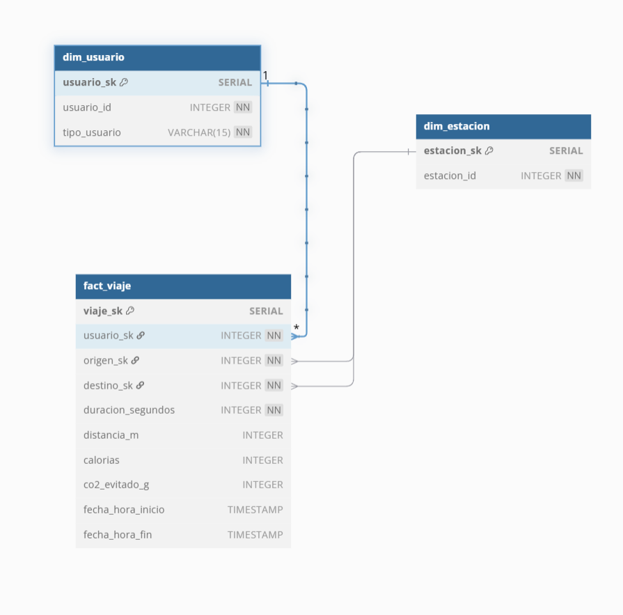
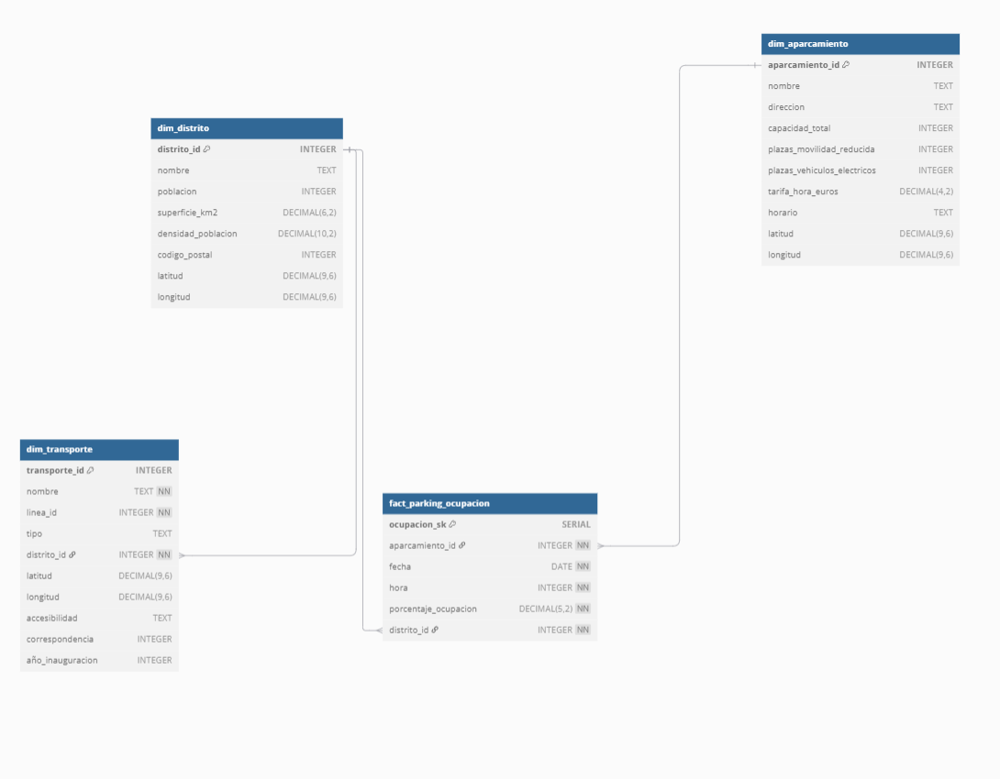

# Práctica Madrid Sostenible - Infraestructura de Almacenamiento para la Ciudad Inteligente

Este repositorio contiene la infraestructura y scripts necesarios para construir un **Data Lakehouse** que integra datos públicos de movilidad, urbanismo, medioambiente, energía y participación ciudadana para el análisis y la toma de decisiones sostenibles en Madrid.

## Diagrama de Infraestructura


La infraestructura diseñada combina un **Data Lake multicapa** y un **Data Warehouse dimensional** para garantizar una gestión flexible, escalable y orientada al análisis de datos urbanos. En la **RAW ZONE** del Data Lake se almacenan los datos en su formato original, mientras que en la **CLEAN ZONE** se aplican transformaciones y validaciones para asegurar calidad y coherencia. Finalmente, la **ACCESS ZONE** ofrece datos listos para el análisis, que alimentan tanto notebooks como bases de datos analíticas.

- **Pregunta 1:** Se abordará mediante un cuaderno `.ipynb`, trabajando directamente sobre los datasets ya transformados en la *ACCESS ZONE*.
- **Pregunta 2:** Se resolverá con consultas **SQL** sobre una base de datos **PostgreSQL** que contiene las tablas generadas a partir de los datos limpios.
- **Pregunta 3:** Se responderá mediante la construcción de **dashboards en Apache Superset**, conectados al **Data Warehouse**, con el objetivo de facilitar el análisis visual a perfiles no técnicos como ciudadanos o asociaciones vecinales.

---

##  Modelo de Datos diseñado
##  Modelo de Datos diseñado

### 1. Data Lake multicapa

El ecosistema de **MinIO** se organiza en *buckets* que representan las zonas clásicas de un Data Lakehouse. Cada etapa corresponde a un sub‐directorio lógico dentro del bucket, lo que facilita el versionado y la gobernanza de los datos.

| Zona | Propósito principal | Ejemplos de objetos (clave S3) |
|------|---------------------|--------------------------------|
| **`raw-ingestion-zone`** | Copia bit-a-bit de las fuentes originales; sin tocar. | `trafico/trafico-horario.csv`, `parking/parkings-rotacion.csv`, `avisamadrid/avisamadrid.json`, `dump-bbdd-municipal/dump-bbdd-municipal.sql` |
| **`clean-zone`** | Datos validados y tipados; reglas de calidad (no nulos, dominios, formatos). | `bicimad/bicimad-usos.parquet`, `demografia/distritos.parquet`, `movilidad/estaciones_transporte.parquet` |
| **`process-zone`** | Enriquecimientos, *joins* y KPIs intermedios. | `movilidad/estaciones_distritos_merged.parquet` |
| **`access-zone`** | Datasets finales listos para BI/ML; granulado acorde a la pregunta de negocio. | `trafico/trafico_congestion_por_hora.parquet`, `bicimad/bicimad-usos.parquet` (curado) |
| **`govern-zone-metadata`** | Catálogo, linaje y KPI de calidad (logs de transformación). | `logs/*.json` generados por `log_data_transformation` |

**Flujo ETL resumido**

1. **Extracción** – `01_ingest_data.py` sube cada fichero a `raw-ingestion-zone`.  
2. **Limpieza** – `02_clean_data.py` aplica validaciones por dataset y publica como Parquet en `clean-zone`.  
3. **Procesado** – `03_access_zone.py` agrega, elimina columnas y genera *joins* antes de mover a `process-` y `access-zone`.  
4. **Gobernanza** – Cada paso escribe un log de linaje y métricas de calidad en `govern-zone-metadata`.

> **Buenas prácticas aplicadas**  
> * Formatos columnares (Parquet) a partir de *clean* para reducir I/O.  
> * Nomenclatura `<dominio>/<dataset>.parquet` que evita colisiones y simplifica `SELECT * FROM s3://...` en Trino.  
> * Validaciones declarativas (reglas `no_nulls`, `unique`, rangos) centralizadas en `validate_data_quality`.

---

### 2. Data Warehouse (PostgreSQL)

Se implementa un **esquema en estrella** con hechos separados por dominio de movilidad y aparcamiento. Las claves sustitutas (`*_sk`) mantienen la integridad temporal y permiten *slowly-changing dimensions* en futuras iteraciones.
El diagrama del primer data warehouse con el que se responde a la primera pregunta del segundo objetivo es el siguiente :

El diagrama del segundo data warehouse con el que se responde a la segunda pregunta del segundo objetivo y al tercer objetivo es el siguiente:

#### Implementación

Los *scripts* de infraestructura (`06_create_datawarehouse.py`) crean el esquema en el contenedor `bbdd_postgre` y añaden índices sobre las claves foráneas para optimizar *star joins*.

---

### 3. Correspondencia Lake → Warehouse

| Dataset *access-zone* | Tabla DW | Transformación adicional |
|-----------------------|----------|--------------------------|
| `bicimad/bicimad-usos.parquet` | `stg_viaje → fact_viaje` | Carga incremental con deduplicación de viajes. |
| `parking/merged-parkings.parquet` | `dim_aparcamiento`, `fact_parking_ocupacion` | Split dimensión / hechos + enriquecimiento distritos. |
| `demografia/distritos.parquet` | `dim_distrito` | Conversión tipo `NUMERIC` y agregación población. |
| `movilidad/estaciones_transporte.parquet` | `dim_estacion`, `dim_transporte` | División metro / bus / cercanías según `tipo`. |

Esta trazabilidad facilita reproducir el pipeline completo y auditar cada métrica de negocio desde la consulta en Superset hasta el fichero bruto original.


---

##  Procesos de Transformación ETL (Extract, Transform, Load)

###  Fase 1: Extracción

Datasets originales:

- `trafico-horario.csv`
- `bicimad-usos.csv`
- `parkings-rotacion.csv` + `ext_aparcamientos_info.csv`
- `dump-bbdd-municipal.sql`
- `avisamadrid.json`

 Suidos a **MinIO** (`raw` zone) mediante `upload_file_to_minio`.


---

### Fase 2: Transformación

Transformaciones aplicadas:
- `avisamadrid.json` → CSV con `extract_json_to_dataframe`
- `dump-bbdd-municipal.sql` → varios `.csv` con `extract_sql_to_dataframes`
- Fusión de aparcamientos con `merge`
- Estandarización de formatos
- Eliminación de duplicados
- Conversión de fechas y tipos
- Validaciones: no nulos, unicidad, integridad

 **Transformaciones por dataset**:

- **Tráfico**: limpieza de duplicados, tipado de fechas
- **Bicimad**: validación de `usuario_id`
- **Parkings**: conversión de coordenadas y tarifas
- **Energía**: control de métricas energéticas
- **Edificios/Distritos**: validación de latitudes y antigüedad
- **Zonas verdes**: normalización booleana y categórica
- **Avisamadrid**: integridad mediante claves y fechas

---

### Fase 3: Carga

1. **Clonar el repositorio**  
   ```bash
   git clone https://github.com/HugoFraile7/Practica2_InfBigData
   cd proyecto-madridsostenible


---

## Puesta en Marcha de la Infraestructura

### Arranque con Docker Compose

```bash
docker compose up -d 
```

Crea en docker todos los contenedores necesarios para el desarrollo de la práctica(Conectividad con **MinIO**, **Trino**, **MariaDB**, **PostgreSQL**) además desde un **Dcokerfile** auxiliar instala todas las dependecias necearias.


- `raw-ingestion-zone`
- `clean-zone`
- `process-zone`
- `access-zone`
- `govern-zone-metadata(información de realización de la práctica)`

---

## Flujo por Zonas

### Zona 1: Raw

Carga de datos originales:

```bash
docker exec -it python-client python /scripts/01_ingest_data.py
```

### Zona 2: Clean

Limpieza y normalización de los datos:

```bash
docker exec -it python-client python /scripts/02_clean_data.py
```

### Zona 3: Process

Agregaciones, KPIs, transformaciones para análisis:

```bash
docker exec -it python-client python /scripts/03_access_zone.py
```

---

## Análisis Visual (Pregunta 1)

Cuaderno Jupyter: `notebooks/01_congestion_vehiculos.ipynb`

-En este cuaderno se carga el dataset **trafico.parquet**, y se realizan las visualizaciones pertinentes para responder a la primera cuestión.

---

## Data Warehouse (PostgreSQL)

### 4️ Crear modelo en PostgreSQL
-Se crean las tablas necesarias.
```bash
docker exec -it python-client python /scripts/04_create_datawarehouse.py
```

### 5️ Carga datos
-Se insertan los datos en las tablas previamente creadas en la etapa anterior.
```bash
docker exec -it python-client python /scripts/05_load_warehouse_data.py
```

### Preguntas de Negocio (Task 2)

** 6️ Rutas BiciMAD más populares**

```bash
docker exec -it python-client python /scripts/06_query_bicimad_routes.py
```

** Densidad vs Transporte**

```bash
docker exec -it python-client python /scripts/07_query_demografia_transporte.py
```

---

##  Estructura del Proyecto

```
/scripts
├── 01_ingest_data.py
├── 02_clean_data.py
├── 03_access_zone.py
├── 04_create_datawarehouse.py
├── 05_load_warehouse_data.py
├── 06_query_bicimad_routes.py
├── 07_query_demografia_transporte.py

/notebooks
└── 01_congestion_vehiculos.ipynb


